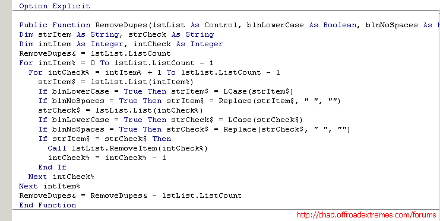

<div align="center">

## A Better, Faster,  Remove Duplicates Function (Kill Dupes, Remove Dupes, Kill Duplicates)<br/>by Chad Roe


</div>

### Description

Please check "http://chad.offroadextremes.com/forums" for all my source code and projects. This is a very fast, very efficient RemoveDupes Function. Every single RemoveDupes Sub/Function I have ever seen on PSCode has been very slow and never removes all the duplicate list items. If the List/Combo contained more than one duplicate, only the first duplicate was removed. My Function, however, removes every single duplicate no matter how many there are. It also does it very quickly without going back through the list. It only sweeps through the list once. This is the fastest and most efficient way of removing dupes in VB. Also, I have added the options to remove all matches no matter the Case or if it has spaces or not, remove matches that only match exactly or any combination of matching options. As an added bonus, I wrote it as a Function to return the number of duplicates removed. You can call this Function like you would a sub for simplicity, or use anything to display the number of dupes removed. EXAMPLES: [1] Call RemoveDupes(List1, True, True) [2] Call MsgBox(RemoveDupes(List1, True, True)) [3] lngDupes&amp; = Call RemoveDupes(List1, True, True)

### More Info

lstList = The List you are removing dupes from. blnLowerCase = Wether you want to match LCase or not. blnNoSpaces = Wether you want to match with or without spaces. Setting both to True will remove all duplicates that are the same no matter what Case they are or if they contain spaces or not. EXAMPLE: "aA a" is the same as "aaa" if both are set to True. "aA a" and "aaa" are different if both are set to False.

As you can see in the code, after an item is removed, I set the current Check Item back one to make up for the item just removed. This is why this Function removes ALL duplicate items and not just the first one. Also, I do not use DoEvents because this drastically slows down the process. To me, this is the greatest Dupe Killer that can be written in Visual Basic.

Returns a ListBox or ComboBox with no duplicate items.

None.

### API Declarations

None.

### Source Code

```
Public Function RemoveDupes(lstList As Control, blnLowerCase As Boolean, blnNoSpaces As Boolean) As Long
Dim strItem As String, strCheck As String
Dim intItem As Integer, intCheck As Integer
RemoveDupes& = lstList.ListCount
For intItem% = 0 To lstList.ListCount - 1
 For intCheck% = intItem% + 1 To lstList.ListCount - 1
  strItem$ = lstList.List(intItem%)
  If blnLowerCase = True Then strItem$ = LCase(strItem$)
  If blnNoSpaces = True Then strItem$ = Replace(strItem$, " ", "")
  strCheck$ = lstList.List(intCheck%)
  If blnLowerCase = True Then strCheck$ = LCase(strCheck$)
  If blnNoSpaces = True Then strCheck$ = Replace(strCheck$, " ", "")
  If strItem$ = strCheck$ Then
   Call lstList.RemoveItem(intCheck%)
   intCheck% = intCheck% - 1
  End If
 Next intCheck%
Next intItem%
RemoveDupes& = RemoveDupes& - lstList.ListCount
End Function
```

